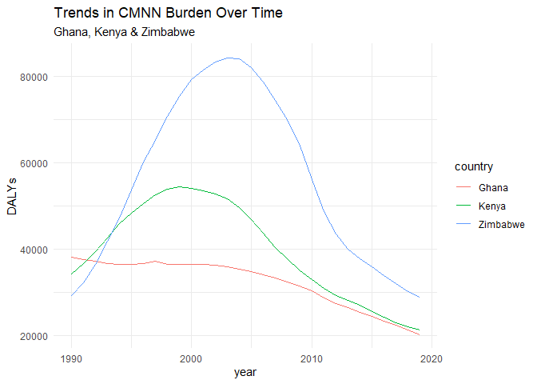

CMNN Burden For Ghana, Kenya & Zimbabwe
================
Jerome Milimu

# Communicable, Maternal, Neonatal, and Nutritional Disease Burden (CMNN)

## Table of Estimates for CMNN Burden Over Time

| year |    Ghana |    Kenya | Zimbabwe |
|-----:|---------:|---------:|---------:|
| 1990 | 38169.03 | 34321.93 | 29182.84 |
| 1991 | 37543.84 | 36629.81 | 32113.44 |
| 1992 | 37134.43 | 39510.43 | 36384.90 |
| 1993 | 36581.16 | 42581.44 | 41867.97 |
| 1994 | 36468.65 | 45822.47 | 47289.24 |
| 1995 | 36486.44 | 48345.59 | 53692.06 |
| 1996 | 36604.25 | 50629.20 | 60272.88 |
| 1997 | 37106.98 | 52614.39 | 65190.26 |
| 1998 | 36529.98 | 53893.87 | 70772.80 |
| 1999 | 36491.57 | 54448.17 | 75437.72 |
| 2000 | 36511.40 | 54031.62 | 79358.74 |
| 2001 | 36543.17 | 53562.06 | 81582.84 |
| 2002 | 36337.37 | 52740.17 | 83412.85 |
| 2003 | 35934.13 | 51644.87 | 84342.70 |
| 2004 | 35389.60 | 49622.21 | 84159.96 |
| 2005 | 34746.13 | 46850.49 | 82067.60 |
| 2006 | 34048.81 | 43667.25 | 78766.43 |
| 2007 | 33299.14 | 40418.84 | 74505.40 |
| 2008 | 32442.34 | 37667.66 | 70026.66 |
| 2009 | 31470.54 | 35177.11 | 64407.06 |
| 2010 | 30352.22 | 32880.90 | 56041.49 |
| 2011 | 28746.38 | 30877.60 | 48765.60 |
| 2012 | 27367.24 | 29278.72 | 43521.72 |
| 2013 | 26364.20 | 28096.14 | 39995.27 |
| 2014 | 25361.35 | 27007.80 | 37784.19 |
| 2015 | 24430.32 | 25610.50 | 35857.23 |
| 2016 | 23350.04 | 24209.18 | 33900.75 |
| 2017 | 22336.89 | 22982.12 | 32081.00 |
| 2018 | 21254.46 | 22034.76 | 30123.21 |
| 2019 | 20202.91 | 21312.06 | 28868.75 |

## Plot Showing Trends in CMNN Burden Over Time

<!-- -->

## Summary of CMNN Burden Findings

Over the Period examined, Zimbabwe had the highest DALYs related to
communicable, maternal, neonatal, and nutritional disease burden.
Followed by Kenya and finally Ghana. It was interesting to note that the
DALYs followed a similar trend to the burden of the HIV/AIDS pandemic
faced by each country
