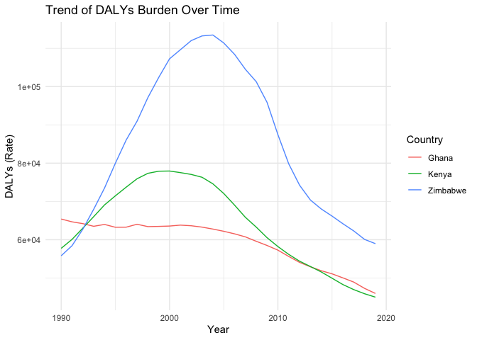

Overall Disease Burden for Ghana, Kenya & Zimbabwe
================
John Andoh

# Overall Disease Burden

We investigate the overall disease burden in DALYs among three
countries; Ghana, Kenya, and Zimababwe

## Table of Estimates for Overall Disease Burden Over Time

| Year |    Ghana |    Kenya |  Zimbabwe |
|-----:|---------:|---------:|----------:|
| 1990 | 65403.59 | 57748.44 |  55804.06 |
| 1991 | 64671.89 | 60086.04 |  58436.03 |
| 1992 | 64200.04 | 63029.53 |  62761.58 |
| 1993 | 63507.64 | 66027.38 |  67959.09 |
| 1994 | 63989.91 | 69087.64 |  73502.46 |
| 1995 | 63252.55 | 71461.35 |  79973.89 |
| 1996 | 63277.94 | 73732.56 |  86054.64 |
| 1997 | 64038.00 | 75916.23 |  90952.65 |
| 1998 | 63422.87 | 77342.45 |  97129.02 |
| 1999 | 63481.72 | 77895.77 | 102385.07 |
| 2000 | 63569.57 | 77946.84 | 107261.71 |
| 2001 | 63813.70 | 77529.49 | 109635.81 |
| 2002 | 63646.88 | 77055.32 | 112014.13 |
| 2003 | 63290.82 | 76316.05 | 113242.14 |
| 2004 | 62780.86 | 74599.45 | 113479.27 |
| 2005 | 62204.93 | 72082.24 | 111406.39 |
| 2006 | 61533.66 | 69041.62 | 108431.35 |
| 2007 | 60739.70 | 65846.52 | 104511.30 |
| 2008 | 59592.35 | 63297.01 | 101294.45 |
| 2009 | 58495.99 | 60531.67 |  95878.42 |
| 2010 | 57274.76 | 58216.78 |  87458.32 |
| 2011 | 55630.43 | 56170.26 |  79822.55 |
| 2012 | 54077.98 | 54392.46 |  74246.77 |
| 2013 | 52929.39 | 52998.88 |  70374.05 |
| 2014 | 51901.16 | 51579.85 |  68034.22 |
| 2015 | 51084.94 | 49936.05 |  66169.40 |
| 2016 | 50030.63 | 48283.05 |  64174.96 |
| 2017 | 48932.66 | 46966.33 |  62297.15 |
| 2018 | 47288.63 | 45887.00 |  60084.52 |
| 2019 | 45965.32 | 44993.50 |  58969.11 |

## Plot Showing Trends in Overall Disease Burden Over Time

<!-- -->

## Summary of Overall Disease Burden Findings

Provide a brief analysis based on the data presented in the table and
chart. Highlight any significant findings or patterns. About 3
sentences.

Zimbabwe had the highest overall disease burden among the three
countries over time. All countries experienced a peak in disease burden
the early 2000s and had been in a sharp decline since then. This can be
attributed to the massive global health efforts in recent years.
